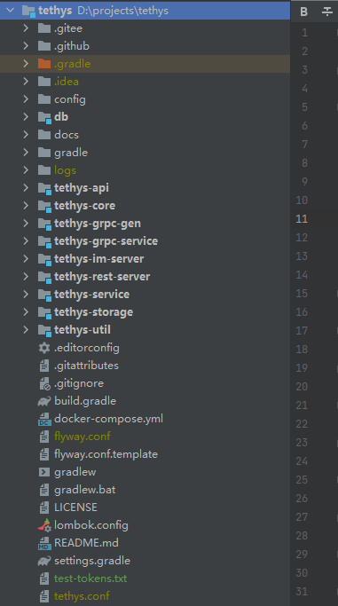
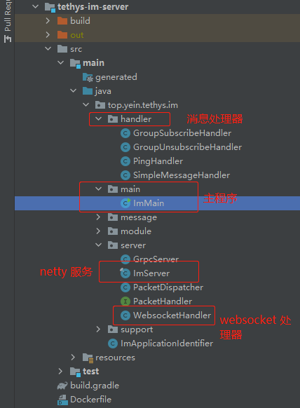

# 基于 reactor-netty 从零开发一个 IM 服务端

## 前言

阅读文本要求，对 Java 11、Gradle、反应式编程有一定的了解。

## Reactor 反应式编程

Reactor 是反应式编程范式的一种实现。

> Reactive programming is an asynchronous programming paradigm concerned with data streams and the propagation of change. This means that it becomes possible to express static (e.g. arrays) or dynamic (e.g. event emitters) data streams with ease via the employed programming language(s).
> 
> 引用 [https://en.wikipedia.org/wiki/Reactive_programming](https://en.wikipedia.org/wiki/Reactive_programming)

事实上，它并不是一个全新的事物，异步编程大家都有了解，Java 里典型的多线程处理就是异步编程。而异步编程时，存在很多难题，比如典型的**回调地狱(Callback Hell)**，层层嵌套的回调函数简直是个灾难。

**反应式编程 VS 异步编程**
```
userService.getFavorites(userId, new Callback<List<String>>() { <1>
  public void onSuccess(List<String> list) { <2>
    if (list.isEmpty()) { <3>
      suggestionService.getSuggestions(new Callback<List<Favorite>>() {
        public void onSuccess(List<Favorite> list) { <4>
          UiUtils.submitOnUiThread(() -> { <5>
            list.stream()
                .limit(5)
                .forEach(uiList::show); <6>
            });
        }

        public void onError(Throwable error) { <7>
          UiUtils.errorPopup(error);
        }
      });
    } else {
      list.stream() <8>
          .limit(5)
          .forEach(favId -> favoriteService.getDetails(favId, <9>
            new Callback<Favorite>() {
              public void onSuccess(Favorite details) {
                UiUtils.submitOnUiThread(() -> uiList.show(details));
              }

              public void onError(Throwable error) {
                UiUtils.errorPopup(error);
              }
            }
          ));
    }
  }

  public void onError(Throwable error) {
    UiUtils.errorPopup(error);
  }
});
```

- <1> 我们有基于回调的服务：一个 `Callback` 接口，在异步程序执行成功时调用一个方法，在发生错误时调用一个方法。
- <2> 第一个服务使用常用 ID 列表调用其回调。
- <3> 如果列表为空，我们必须转到 `suggestionService`。
- <4> `suggestionService` 向第二个回调提供一个 `List<Favorite>`。
- <5> 因为我们处理的是 UI，所以我们需要确保我们的消费代码在 **UI 线程**中运行。
- <6> 我们使用 Java 8 `Stream` 将处理的建议数量限制为5个，并在 UI 的图形列表中显示它们。
- <7> 在每个级别上，我们处理错误的方式都是相同的：在弹出窗口中显示错误。
- <8> 回到最喜欢的 ID 级别。如果服务返回完整列表，我们需要转到 `favoriteService` 以获取详细的 `Favorite ` 对象。因为我们只需要5个，所以我们首先流式处理 ID 列表，将其限制为5个。
- <9> 最后一个 `Callback`。这一次，我们得到了一个完全成熟的最喜欢的对象，我们将其推送到 **UI 线程**内的 UI。

```
userService.getFavorites(userId) <1>
    .flatMap(favoriteService::getDetails) <2>
    .switchIfEmpty(suggestionService.getSuggestions()) <3>
    .take(5) <4>
    .publishOn(UiUtils.uiThreadScheduler()) <5>
    .subscribe(uiList::show, UiUtils::errorPopup); <6>
```

- <1> 我们从最喜欢的 ID 流开始。
- <2> 我们异步地将这些对象转换为详细的 `Favorite` 对象（`flatMap`）。我们现在有一个 `Favorite` 的流。
- <3> 如果 `Favorite` 流为空，则通过 `suggestionService` 切换到回退。
- <4> 我们最多只对结果流中的 5 个元素感兴趣。
- <5> 最后，我们要处理 **UI 线程**中的每一段数据。
- <6> 我们通过描述如何处理数据的最终形式（在 UI 列表中显示）以及发生错误时如何处理（显示弹出窗口）来触发流。

从上面的比较我们可以看出，使用反应式 API 能更简单、优雅的实现相同的业务逻辑。

## Netty 简介

Netty 是一个 NIO client-server 框架，可以快速和简单的开发网络应用程序，比如协议服务器服务器和客户端。Netty向你提供了一种新的方式开发你的网络应用程序，使得它简单和可扩展。它通过这样的方式实现：抽象出所涉及的复杂性和通过提供一种简单易用的 API，这个将业务逻辑从网络处理代码中解耦出来。因为它是使用 NIO 构建，所有的 Netty API 都是异步的。


## 源码
**代码仓库：**

[https://gitee.com/kk70/tethys](https://gitee.com/kk70/tethys)

**源码结构：**



**Tethys 目录介绍：**
```
tethys                    项目根目录
  |- .gitee               存放 gitee 源码托管的配置
  |- .github              存放 github 源码托管的配置
  |- config               Tethys 项目所使用的配置
  |- db                   数据库 Schema 脚本
  |- docs                 Tethys 文档存放目录
  |- tethys-api           Tethys 基础 API 模块
  |- tethys-core          Tethys 公共的核心逻辑模块
  |- tethys-util          公共的工具类模块
  |- tethys-grpc-gen      Tethys gRPC 生成代码及 proto 文件管理模块
  |- tethys-grpc-service  Tethys gRPC Stub 服务逻辑实现模块
  |- tethys-storage       Tethys 数据存储逻辑实现模块
  |- tethys-service       Tethys 服务逻辑实现模块
  |- tethys-im-server     IM 服务端逻辑实现及服务入口
  |- tethys-rest-server   REST 服务逻辑实现及服务入口
```

## 构建 IM 服务端



### ImServer 类
```java
@Log4j2
public final class ImServer {

  private final String addr;
  private final WebsocketHandler websocketHandler;
  private final Interceptors interceptors;
  private final List<RoutingService> routingServices;

  private DisposableServer disposableServer;

  /**
   * 能被 IoC 容器使用的构造函数.
   *
   * @param addr 服务的 IP 和端口
   * @param websocketHandler WS 处理器
   * @param interceptors 拦截器
   * @param routingServices HTTP 路由服务列表
   */
  @Inject
  public ImServer(
      String addr,
      WebsocketHandler websocketHandler,
      Interceptors interceptors,
      List<RoutingService> routingServices) {
    this.addr = addr;
    this.websocketHandler = websocketHandler;
    this.interceptors = interceptors;
    this.routingServices = routingServices;
  }

  /** 启动 IM 服务. */
  public void start() {
    var hap = HostAndPort.fromString(addr);

    // <2.1> 注册 HTTP 路由
    var routes = HttpServerRoutes.newRoutes();
    for (RoutingService routingService : routingServices) {
      log.info("更新 Routes [resource={}]", routingService);
      routingService.update(routes, interceptors);
    }

    // <2.2> IM WebSocket 注册
    routes.ws(
        "/im", websocketHandler::handle, WebsocketServerSpec.builder()
        // <2.3> 禁用 WebSocket 内置的 Ping 功能
        .handlePing(false).build());

    // <2.4> Netty CORS 配置
    var corsConfig = CorsConfigBuilder.forAnyOrigin().build();
    this.disposableServer =
        HttpServer.create()
            .host(hap.getHost())
            .port(hap.getPort())
            // <2.5> 新的链接中添加跨域处理器
            .doOnConnection(connection -> connection.addHandler(new CorsHandler(corsConfig)))
            .wiretap(Env.current() != Env.PROD)
            // <2.6> 注册 HTTP 路由处理器
            .handle(new HttpServerRoutesWrapper(routes))
            // <2.7> 启动 Netty 服务
            .bindNow();
    log.info("IM Server 启动完成 - {}", hap);
  }

  /** 停止 IM 服务. */
  public void stop() {
    if (disposableServer != null) {
      // <3.1> 优雅停止 reactor-netty 服务
      disposableServer.disposeNow();
    }
    log.info("IM Server 停止完成 - {}", addr);
  }
}
```

### ② 启动 reactor-netty 服务的逻辑
- **<2.1>** 注册 HTTP 路由，这里服务可能会有应用信息、健康检查等接口可通过 `RoutingService` 注册。
- **<2.2>** 注册 WebSocket 处理器。
- **<2.3>** 禁用 netty 默认的 WebSocket `ping/pong` 实现逻辑，`ping` 一般我们会用于心跳，维持连接状态，但是像很多 WebSocket 实现并不支持默认的 `ping/pong` 逻辑，所以我们尽量单独提供消息来实现心跳逻辑。
- **<2.4>** CORS 跨域配置，netty 已经有 CORS 实现，这里创建一个单例的 `corsConfig` 实例，后面可重复使用该实例。
- **<2.5>** 在客户端连接之前我们向 reactor-netty 添加 `CorsHandler` 处理器，这样才可保证请求是支持跨域处理的。
- **<2.6>** 向 reactor-netty 注册 HTTP 处理器（这里使用了一个 Wrapper 包装器后续我们在详细了解 `HttpServerRoutesWrapper` 的实现）。

### ③ 停止 reactor-netty 服务

- **<3.1>** 这里使用的 `disposeNow` 方法释放 reactor-netty，该方法实现默认会阻塞 3 秒等待 reactor-netty 所有资源释放。

